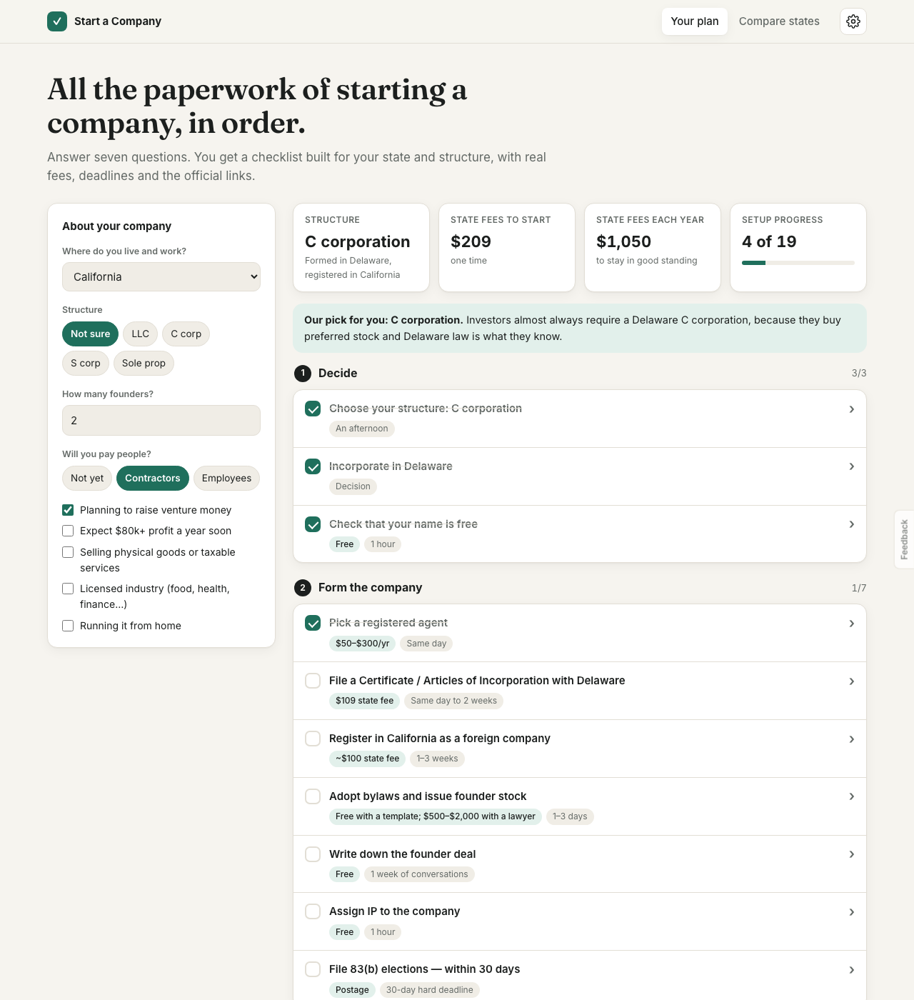
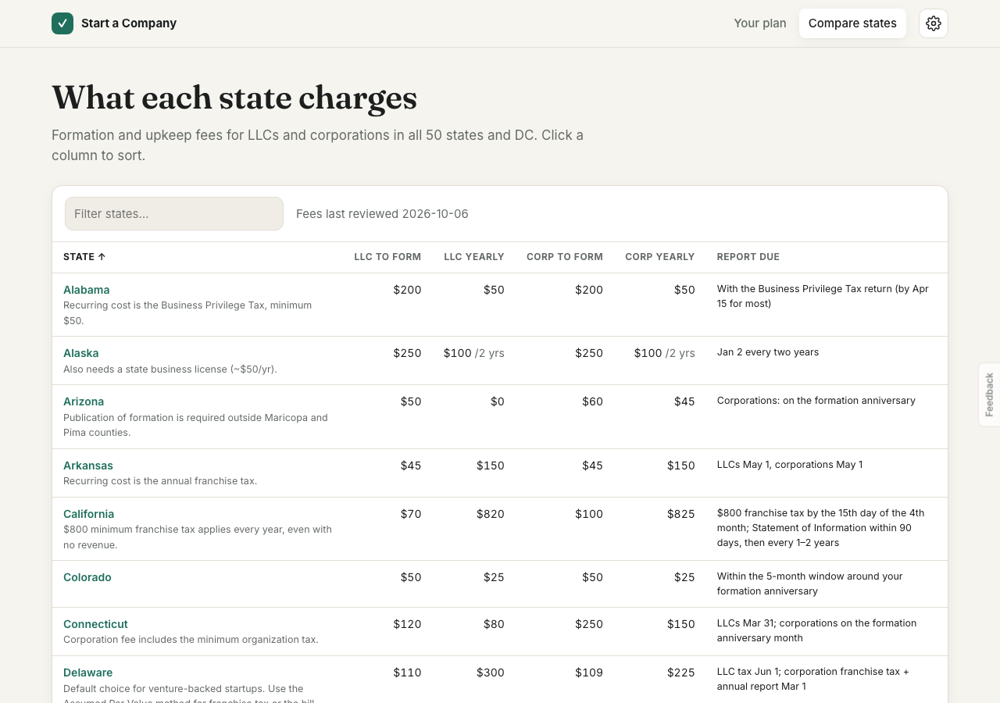
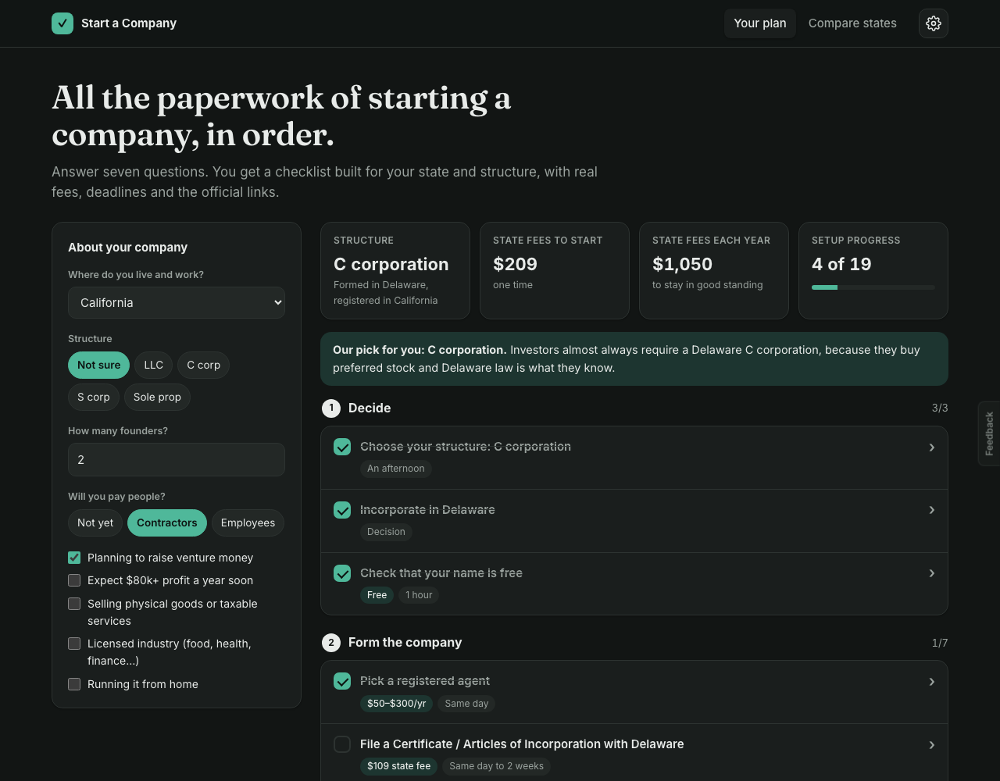
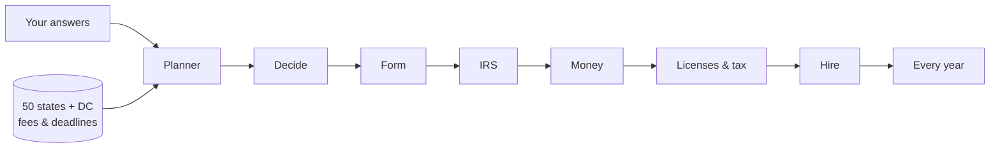

# Start a Company

A personal, step-by-step checklist for the paperwork of starting a US company. You answer seven questions and get your structure, state filings, IRS, bank, licenses and yearly upkeep, with real fees and official links.

**[Open the site →](https://amalmehta.github.io/StartACompany/)**

| Compare every state's fees | Dark mode |
|---|---|
|  |  |

## Links

- [Instructions](docs/INSTRUCTIONS.md): run it, use it, update the fee data
- [System design](docs/SYSTEM-DESIGN.md): architecture, flows, decisions, limits
- [File structure](docs/FILE-STRUCTURE.md): what's where

*Not legal or tax advice. Fees change, so confirm on the official site linked from each step.*
