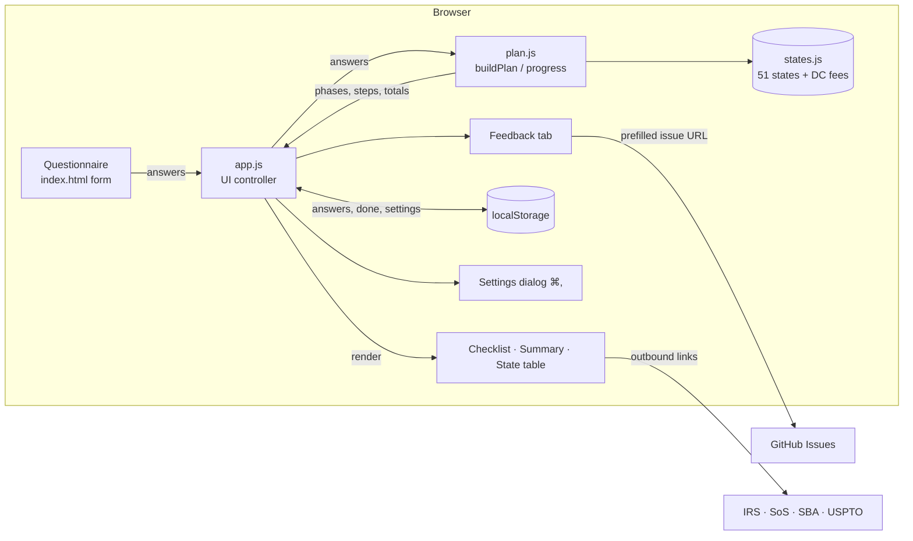

# System Design

Start a Company is a static website. It asks a founder seven questions and returns an ordered checklist of every legal, tax and compliance step for their US state and business structure. There is no server and no account. Everything runs and is saved in the browser.

## Architecture

## Components

| File | Job |
|---|---|
| `index.html` | Page shell: header and tabs, questionnaire, plan area, state table, settings and feedback dialogs. |
| `styles.css` | All styling. Color tokens on `:root` with light and dark themes (system preference or forced by a setting), a responsive two-column layout that becomes one column under 880px, and print styles. |
| `src/plan.js` | **The brains.** Pure functions with no DOM. `resolve()` turns answers into facts (entity, which state to form in, whether a foreign registration is needed). `buildPlan()` filters and renders the step catalogue (`STEPS`) and totals the state fees. `recommendEntity()` handles "Not sure". `progress()` counts finished setup steps. |
| `src/data/states.js` | Formation fees, recurring fees, cadence, due dates, notes and official filing-office URL for each of the 50 states plus DC. `DATA_REVIEWED` is shown in the UI. |
| `src/store.js` | Guarded `localStorage` read, write and clear. The app still works if storage is blocked. |
| `src/app.js` | Wires everything together: form → plan → render, checkbox and expand state, sortable and filterable state table, hash routing between tabs, settings (theme, cost display, hide finished, expand all, export, import, print, reset), and the feedback dialog. |
| `tests/plan.test.js` | Node's built-in test runner against `plan.js` and `states.js`. |

## Main flows

1. **Build a plan.** Any form `input` event → `state.answers` is updated → saved → `buildPlan(answers)` → the summary cards and phases are re-rendered. With no state chosen, `buildPlan` returns `null` and the empty state shows.
2. **Not sure which structure.** With `entity: "unsure"`, `recommendEntity` picks one: a Delaware C corp if raising VC, an S corp if profit is expected soon, otherwise a home-state LLC. The plan is built for that pick and the reason is shown.
3. **Delaware plus home state.** A C corp formed in Delaware while living elsewhere sets `foreign = true`. That adds a foreign-registration step, a second yearly report, and both states' fees to the totals.
4. **Check off steps.** Checkbox → `state.done[id]` → saved → re-render. Progress counts only one-time setup steps; recurring yearly items are excluded.
5. **Settings.** Gear button or ⌘, / Ctrl+, opens the dialog. Changes apply immediately and are saved.
6. **Feedback.** The side tab opens a dialog. Submitting opens a prefilled GitHub issue in a new tab, which the person reviews and posts themselves.

## Where data lives

- **Reference data**: `src/data/states.js` and the `STEPS` catalogue in `src/plan.js`. These are versioned in git.
- **User data**: one `localStorage` key, `start-a-company:v1` → `{ answers, done, settings }`. It is never sent anywhere. Export and import move it between browsers as JSON.

## Key decisions and trade-offs

| Decision | Why | Trade-off |
|---|---|---|
| Static site, no backend | Free to host on GitHub Pages, private by design, nothing to maintain | No sync across devices (export/import covers it); feedback goes through GitHub |
| No framework or build step | ES modules in the browser; the same `plan.js` runs in Node tests | Manual DOM rendering; fine at this size |
| Steps as data with `when(c)` predicates | Adding or changing a rule is one object; easy to test exhaustively | Copy lives in JS rather than a CMS |
| Fees hard-coded with a review date and an official link on every step | Gives real numbers people can budget with | Fees go stale; the date and links make that visible |
| State fee totals only | These are the numbers people get wrong and they're knowable | Lawyer, agent, insurance and CPA costs appear as ranges per step, not in the totals |
| Delaware offered only for C corps | That's where Delaware actually pays off | LLC-in-Wyoming/Delaware strategies aren't modelled |

## Testing

- `npm test` runs 14 Node tests. They check the state data shape (51 entries, valid numbers and URLs) and each branching rule (VC → DE C corp + foreign registration, solo and multi-member LLC returns, sole prop, S corp, publication states, biennial and no-report states, optional situations, progress). One test builds a plan for **every state × every structure** and checks that no text contains `undefined`, `null` or `NaN`.
- The UI was checked by hand in a browser at desktop and phone widths, in light and dark themes, with the settings shortcut, export/import and print.

## Known limits

- US only. Fees are compiled from public sources and reviewed on the date shown. They are not live, and some states add surcharges or expedite fees.
- City and county licences, state sales-tax agencies and industry licences link to general SBA guidance rather than each local office.
- Assumes a calendar tax year for federal deadlines.
- Not legal or tax advice. It doesn't file anything for you.
- ⌘, may be captured by some browsers before the page sees it. The gear button always works.
